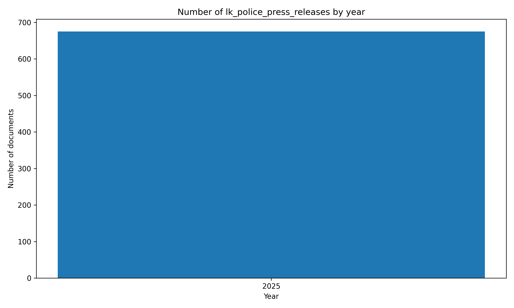

# 🇱🇰 #SriLanka Police Press Releases `Dataset`


[https://github.com/nuuuwan/lk_police_press_releases](https://github.com/nuuuwan/lk_police_press_releases)

📜 [**1** documents](https://github.com/nuuuwan/lk_police_press_releases/tree/data) (**0.2 GB**), from **2025-09-18** to **2025-09-18**, scraped from **[https://www.police.lk/](https://www.police.lk/)**

📑 In JSON, PDF, TXT and 🤗 Hugging Face Formats

⏰ Updated **at least Daily**

🆓 Public data & fully open-source

#OpenData #DataScience #DataForGood #ResearchData #NLP

...

*📒 PDFs have been downloaded for **0** (**0%**) documents*

🪲 #WorkInProgress - Suggestions, Questions, Ideas, & [Bug Reports](https://github.com/nuuuwan/lk_police_press_releases/issues) are welcome!

## 📝 Example Metadata

```json
{
    "doc_type": "lk_police_press_releases",
    "doc_id": "2025-09-18-2025-09-18-06-30",
    "num": "2025-09-18 06:30",
    "date_str": "2025-09-18",
    "description": "2025-09-18 06:30",
    "url_metadata": "https://www.police.lk/?p=13977",
    "lang": "si",
    "url_pdf": "https://www.police.lk/wp-content/uploads/2025/09/Media-on-2025.09.18-at-0630-_compressed.pdf",
    "time_str": "2025-09-18 06:30"
}
```

## Documents By Year



## 🤗 Hugging Face Datasets


- 📄 [nuuuwan/lk-police-press-releases-docs](https://huggingface.co/datasets/nuuuwan/lk-police-press-releases-docs)
- 📦 [nuuuwan/lk-police-press-releases-chunks](https://huggingface.co/datasets/nuuuwan/lk-police-press-releases-chunks)

## 🆕 20 Latest documents

- 2025-09-18 | `2025-09-18 06:30` | 2025-09-18 06:30 | [data](https://github.com/nuuuwan/lk_police_press_releases/tree/data/data/lk_police_press_releases/2020s/2025/2025-09-18-2025-09-18-06-30)

---


